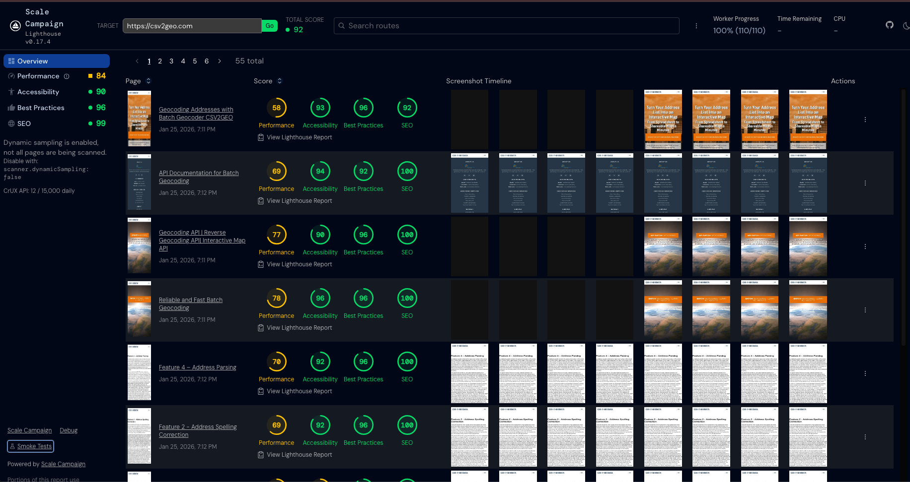
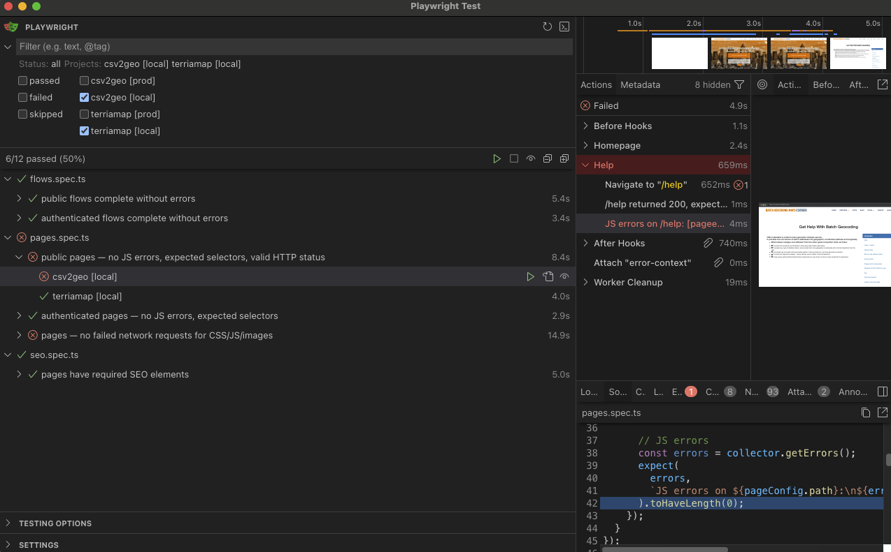

# ScaleLighthouse

A one-stop quality assurance platform for web developers. Run Lighthouse performance audits, Playwright smoke tests, and CrUX real-user metrics — in dev mode, in production, manually or on a schedule.

ScaleLighthouse combines three tools into a single monorepo so you can catch performance regressions, JavaScript errors, broken pages, and SEO problems from one place.

<p align="center">
  
</p>

<p align="center">
  
</p>

## What It Does

| Capability | Tool | What It Catches |
|---|---|---|
| Performance audits | Lighthouse | Slow LCP, high CLS, render-blocking resources, accessibility issues |
| JS error detection | Playwright | `TypeError`, missing libraries, broken third-party scripts |
| Page health checks | Playwright | Missing DOM elements, 404 resources (CSS/JS/images), broken navigation |
| Functional flow testing | Playwright | File upload breaks, form submission fails, multi-step workflows regress |
| SEO validation | Playwright | Missing meta tags, broken OG images, missing canonical URLs |
| Real-user metrics | CrUX API | INP, CLS, LCP trends from Chrome UX Report field data |

## Architecture

```
scalelighthouse/
├── packages/
│   ├── cli/                    # CLI entry point — `unlighthouse --site <url>`
│   ├── core/                   # Scanning engine, route discovery, Lighthouse runner
│   ├── server/                 # API server serving scan results to the client
│   ├── client/                 # Vue 3 dashboard UI (Vite build)
│   ├── smoke-tests/            # Playwright-based smoke test framework
│   │   ├── lib/                # Console error collector, auth, fixtures, types
│   │   ├── tests/              # Generic test specs (pages, flows, SEO)
│   │   ├── targets/            # Per-site config files (gitignored, user-defined)
│   │   └── launcher.mjs        # HTTP bridge to open Playwright UI from dashboard
│   ├── unlighthouse/           # Main package
│   └── unlighthouse-ci/        # CI/CD integration
├── crux-api/                   # Nitro server for Chrome UX Report data
├── docs/                       # Documentation site
└── pnpm-workspace.yaml         # pnpm monorepo config
```

The monorepo uses **pnpm workspaces** — all packages under `packages/*` are auto-discovered. The `catalog:` field in `pnpm-workspace.yaml` pins shared dependency versions across all packages.

## Quick Start

### Prerequisites

- Node.js >= 20.x
- pnpm >= 10.x

### Install

```bash
git clone https://github.com/scalecampaign/lighthouse.git
cd lighthouse
pnpm install
```

### Run Lighthouse Audit

```bash
# Scan any website
pnpm cli --site https://your-site.com

# With a specific port for the dashboard
pnpm cli --site https://your-site.com --server-port 5678
```

Open `http://localhost:5678` to view the dashboard.

### Run Smoke Tests

```bash
cd packages/smoke-tests

# Install browser (first time only)
npx playwright install chromium

# Run all configured targets
npx playwright test

# Open Playwright UI
npx playwright test --ui
```

## Smoke Tests

The smoke test framework is a generic, data-driven Playwright test suite. You define **targets** (your sites) via config files — the test specs iterate over your config automatically. No test code to write.

### How It Works

1. You create a **target config** file that describes your site: pages, required selectors, login flow, functional flows, SEO expectations
2. You register the target in **registry.ts**
3. The generic test specs (`pages.spec.ts`, `flows.spec.ts`, `seo.spec.ts`) read your config and generate tests dynamically
4. Playwright creates **two projects per target** — one for production, one for local dev — so you can test both environments from the same UI

### Setting Up Your First Target

#### 1. Create the config file

```bash
cd packages/smoke-tests/targets
cp example.config.ts my-site.config.ts
```

Edit `my-site.config.ts`:

```typescript
import type { ProductTarget } from '../lib/types.js';

const mySite: ProductTarget = {
  name: 'my-site',
  baseUrl: 'http://localhost:3000',       // Local dev URL
  baseUrlEnv: 'MY_SITE_URL',             // Env var for production URL

  pages: [
    { path: '/', name: 'Homepage', selectors: ['#app', 'nav'] },
    { path: '/about', name: 'About' },
    { path: '/dashboard', name: 'Dashboard', auth: true, selectors: ['.dashboard-grid'] },
  ],

  allowedErrors: ['analytics', 'hotjar'],
};

export default mySite;
```

#### 2. Register the target

```bash
cp example.registry.ts registry.ts
```

Edit `registry.ts`:

```typescript
import mySite from './my-site.config.js';

export const targets = [mySite];
```

#### 3. Set up environment variables

```bash
cp .env.example .env
```

Edit `.env`:

```
MY_SITE_URL=https://my-site.com
```

#### 4. Run

```bash
npx playwright test                   # All targets, all environments
npx playwright test --project="my-site [prod]"   # Production only
npx playwright test --project="my-site [local]"  # Local dev only
npx playwright test --ui              # Interactive UI
```

### Target Config Reference

The `ProductTarget` type defines everything about a site to test:

```typescript
interface ProductTarget {
  name: string;              // Unique name (becomes Playwright project name)
  baseUrl: string;           // Base URL for local/default testing
  baseUrlEnv?: string;       // Env var name to override baseUrl for production

  pages: PageConfig[];       // Pages to smoke test
  auth?: AuthConfig;         // Login configuration (for pages with auth: true)
  flows?: FlowConfig[];      // Multi-step functional flow tests
  seo?: { pages: SeoPageConfig[] };  // SEO metadata checks

  allowedErrors?: string[];  // JS error regex patterns to ignore
}
```

#### Pages

Each page defines a URL path and optional assertions:

```typescript
interface PageConfig {
  path: string;              // URL path (e.g., '/dashboard')
  name?: string;             // Human-readable label for reports
  selectors?: string[];      // CSS selectors that must be visible on the page
  auth?: boolean;            // Requires authentication (default: false)
  expectedStatus?: number;   // Expected HTTP status (default: 200)
}
```

The page tests check:
- HTTP response status matches `expectedStatus`
- All `selectors` are visible within 10 seconds
- Zero unexpected JavaScript console errors
- No failed network requests (CSS, JS, images, fonts return HTTP < 400)

#### Authentication

Four strategies are supported for testing pages behind login:

**Form login** (most common):

```typescript
auth: {
  strategy: 'form',
  loginUrl: '/login',
  fields: {
    '#email': '${MY_SITE_EMAIL}',         // CSS selector → env var value
    '#password': '${MY_SITE_PASSWORD}',
  },
  submitSelector: 'button[type="submit"]',
  successIndicator: '/dashboard',          // URL path or CSS selector to wait for
}
```

The `${ENV_VAR}` syntax resolves to `process.env.ENV_VAR` at runtime. Credentials are stored in `.env` (gitignored).

**Other strategies:**

```typescript
// Bearer token
auth: { strategy: 'bearer', token: '${MY_API_TOKEN}' }

// Basic auth
auth: { strategy: 'basic', username: '${USER}', password: '${PASS}' }

// Cookie injection
auth: { strategy: 'cookie', cookieName: 'session', cookieValue: '${SESSION_TOKEN}' }
```

Auth state (cookies/session) is cached in `auth-state/` for 24 hours by default. Change with `maxAge` (in ms).

#### Flows

Multi-step functional tests that simulate real user workflows:

```typescript
flows: [
  {
    name: 'CSV file upload',
    auth: false,                          // Set true for authenticated flows
    steps: [
      { action: 'goto', path: '/' },
      { action: 'upload', selector: '#file-input', value: 'fixtures/sample.csv' },
      { action: 'wait', selector: '#results-table', timeout: 10000 },
    ],
    expectSelectors: ['#results-table'],  // Must be visible after all steps
    expectNoJsErrors: true,               // Assert zero JS errors during flow
  },
],
```

Available step actions:

| Action | Fields | Description |
|---|---|---|
| `goto` | `path` | Navigate to URL path |
| `click` | `selector` | Click an element |
| `fill` | `selector`, `value` | Type text into an input |
| `upload` | `selector`, `value` | Upload a file (path relative to `tests/`) |
| `wait` | `selector`, `timeout` | Wait for element to become visible |
| `select` | `selector`, `value` | Select a dropdown option |
| `press` | `value` | Press a keyboard key |

#### SEO

Validate meta tags, Open Graph data, and heading structure:

```typescript
seo: {
  pages: [
    {
      path: '/',
      title: /My Site/i,                  // String or RegExp
      description: /your site description/i,
      ogTitle: 'My Site - Homepage',
      ogImage: /.+/,                      // Just check it exists
      canonical: 'https://my-site.com/',
      h1: /Welcome/,
      noindex: false,                     // Check for noindex robots tag
    },
  ],
},
```

### Console Error Detection

The `ConsoleErrorCollector` attaches to every page load and captures JavaScript errors. Common third-party noise is filtered by default:

- Google Analytics / Tag Manager
- Hotjar, Rollbar, Sentry
- `favicon.ico` errors
- `ResizeObserver loop` warnings
- `Non-Error promise rejection`
- Ad-blocker `net::ERR_BLOCKED_BY_CLIENT`

Add your own ignore patterns via `allowedErrors` in the target config (case-insensitive regex).

### Environment Switching: Local vs Production

The Playwright config creates **two projects per target**:

- `my-site [prod]` — uses the URL from `process.env[baseUrlEnv]`
- `my-site [local]` — uses `baseUrl` directly

In the Playwright UI, both appear in the project sidebar so you can test either environment with one click. If the env var is not set, only the local project is created.

### File Structure

```
packages/smoke-tests/
├── lib/
│   ├── types.ts              # ProductTarget, PageConfig, FlowConfig, etc.
│   ├── console-errors.ts     # JS error collection + allow-list filtering
│   ├── auth.ts               # Login strategies + session caching
│   └── fixtures.ts           # Playwright fixture injecting target config
├── tests/
│   ├── pages.spec.ts         # Page status, selectors, JS errors, resource checks
│   ├── flows.spec.ts         # Multi-step functional flow tests
│   └── seo.spec.ts           # Meta tags, OG, canonical, h1, noindex
├── targets/
│   ├── example.config.ts     # Template (tracked in git)
│   ├── example.registry.ts   # Template (tracked in git)
│   ├── *.config.ts           # Your configs (gitignored)
│   └── registry.ts           # Your registry (gitignored)
├── fixtures/                 # Test data files (CSVs, images, etc.)
├── auth-state/               # Cached login sessions (gitignored)
├── results/                  # JSON test results (gitignored)
├── playwright.config.ts      # Dynamic project generation from targets
├── launcher.mjs              # HTTP server to launch Playwright UI from dashboard
├── package.json
├── .env                      # Credentials (gitignored)
└── .env.example              # Env var template
```

### Gitignored vs Tracked

| File | Tracked | Why |
|---|---|---|
| `example.config.ts` | Yes | Template for new users |
| `example.registry.ts` | Yes | Template for new users |
| `*.config.ts` (others) | No | Contains site-specific URLs and selectors |
| `registry.ts` | No | Personal list of targets |
| `.env` | No | Contains credentials |
| `auth-state/` | No | Contains session cookies |
| `results/` | No | Generated test output |

## CrUX API (Chrome User Experience Report)

ScaleLighthouse includes a standalone Nitro server that fetches real-user performance data from Google's Chrome UX Report API. The dashboard displays INP, CLS, and LCP trends over time.

### Setup

1. Go to the [Google Cloud Console — Credentials](https://console.cloud.google.com/apis/credentials)
2. Create or select a project
3. Enable the **Chrome UX Report API**
4. Create an API key
5. Create `crux-api/.env`:

```
NITRO_GOOGLE_CRUX_API_TOKEN=your-api-key-here
```

6. Start the CrUX API server:

```bash
cd crux-api
pnpm dev
```

The dashboard automatically connects to `http://localhost:3001` and displays CrUX data when available.

## Running Modes

### Development (Local)

Run Lighthouse and smoke tests against your local dev server:

```bash
# Terminal 1: Start your app
cd /path/to/your-app && npm run dev

# Terminal 2: Lighthouse audit
pnpm cli --site http://localhost:3000

# Terminal 3: Smoke tests
cd packages/smoke-tests
npx playwright test --project="my-site [local]"
```

### Production (Manual)

Test against live production URLs:

```bash
# Lighthouse
pnpm cli --site https://your-site.com

# Smoke tests (reads URL from .env)
cd packages/smoke-tests
npx playwright test --project="my-site [prod]"
```

### Production (Scheduled)

Set up a cron job on your server to run smoke tests on a schedule:

```bash
# Example: daily at 6 AM
0 6 * * * cd /path/to/lighthouse/packages/smoke-tests && npx playwright test 2>&1 >> /var/log/smoke-tests.log
```

Results are written to `results/latest.json` for programmatic consumption.

## Launcher — Starting Playwright UI from the Dashboard

The ScaleLighthouse dashboard has a **Smoke Tests** button in the sidebar. Clicking it launches the Playwright UI in its own window (Playwright uses an Electron-based app, not a browser tab).

This works through a lightweight HTTP bridge (`launcher.mjs`) that runs alongside the dashboard.

### Starting the Launcher

```bash
cd packages/smoke-tests

# Option 1: via pnpm script
pnpm launcher

# Option 2: directly
node launcher.mjs
```

The launcher listens on `http://localhost:9322`:

| Endpoint | Description |
|---|---|
| `GET /launch` | Spawns `npx playwright test --ui` in a new window |
| `GET /status` | Returns `{ "running": true/false }` |

If the launcher is not running when you click the dashboard button, you will see a "start launcher first" message.

### Running Both Together

```bash
# Terminal 1: Lighthouse dashboard
pnpm cli --site https://your-site.com --server-port 5678

# Terminal 2: Smoke test launcher
cd packages/smoke-tests && node launcher.mjs
```

Then open `http://localhost:5678` — the dashboard and smoke tests are both accessible.

## CLI Commands Reference

### Lighthouse

```bash
pnpm cli --site <url>                         # Scan a site
pnpm cli --site <url> --server-port 5678      # Custom port
pnpm cli --site <url> --debug                 # Debug mode
```

### Smoke Tests

```bash
cd packages/smoke-tests

npx playwright test                           # Run all tests, all targets
npx playwright test --ui                      # Interactive UI mode
npx playwright test --headed                  # Visible browser
npx playwright test --debug                   # Step-through debugger
npx playwright test --project="my-site [prod]"  # Single project
npx playwright test tests/pages.spec.ts       # Single test file
```

### Monorepo

```bash
pnpm install                                  # Install all dependencies
pnpm build:pkg                                # Build all packages
pnpm lint                                     # ESLint fix
pnpm test                                     # Root vitest tests
```

## .gitignore

Add this to your root `.gitignore`:

```
.unlighthouse
```

The smoke tests package has its own `.gitignore` for credentials, results, and user configs.

## License

Licensed under the [MIT license](LICENSE.md).

Built by [Scale Campaign](https://scalecampaign.com). Forked from [Unlighthouse](https://github.com/harlan-zw/unlighthouse) by Harlan Wilton.
